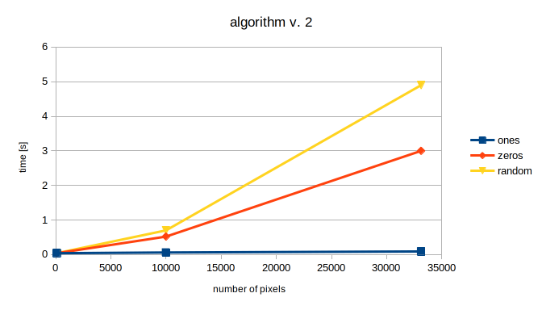
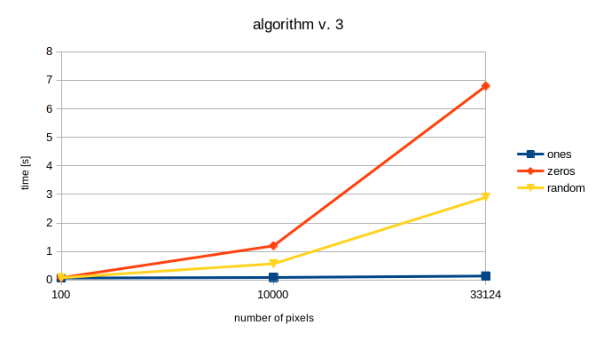
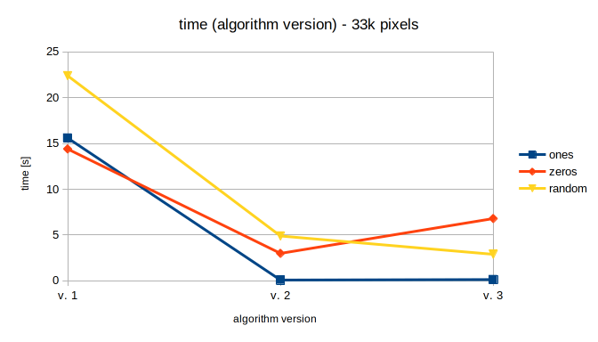

# Interview task for c9...
If you don't know why you are here, in this repo, just leave. This repo should be public and README shouldn't be too descriptive.

## Usage

Preparation:
```
npm i
npm test
```

Script can be used from terminal or as a module.
Terminal allows to use script with pipes and arguments.
```
cat sample/input-01.txt | node ./src/index.js
node ./src/index.js sample/input-02.txt
```

Sample input and output files are stored in **sample** directory.

Folder **output** contains results of outputs from terminal - just in case.

## Algorithm

* algorithm is not searching for pixels in "spiral" way, somehow I didn't think about it, but it should be the main idea
* use of short-circuit evaluation in two cases: pixel is white itself, or some neighbor is white
* number of neighbors to pre-check depends on number of pixels in the whole bitmap
* if no neighbor have white pixel, then whole bitmap is checked
* third version of algorithm is slower for "zero" bitmaps, but "random" bitmap type was the priority

## TODO

Things that can be done better:
* algorithm: still too greedy
* cyclomatic complexity too high
* separation form library and interface/terminal wrapper seems to be good idea
* names of methods/function/files aren't too good
* neighbors could depend on bitmap shape (high or wide bitmaps should have different shape of pre-check neighbors "circle")

## Performance

### Algorithm version: 1 (5e3c7d9)
| input size  | ones | zeros | random |
|-------------|----- |-------|--------|
| 100         | 0.04 | 0.04  | 0.07   |
| 10000       | 1.48 | 1.33  | 2.088  |
| 33124       | 15.6 | 14.4  | 22.4   |


### Algorithm version: 2 (15c994b)
| input size  | ones  | zeros | random |
|-------------|-------|-------|--------|
| 100         | 0.04  | 0.04  | 0.04   |
| 10000       | 0.06  | 0.52  | 0.7    |
| 33124       | 0.09  | 3     | 4.9    |





### Algorithm version: 3 (a673708)
| input size  | ones  | zeros | random |
|-------------|-------|-------|--------|
| 100         | 0.07  | 0.08  | 0.08   |
| 10000       | 0.09  | 1.2   | 0.57   |
| 33124       | 0.14  | 6.8   | 2.9    |





### Performance change



## Useful things

Compare result with predefined outputs
```
node ./src/index.js sample/input-10-random-100x100-10000.txt > /dev/null; diff sample/output-10-random-100x100-10000.txt $( ls -t output/*.txt | head -1)
```


Run performance test
```
time node ./src/index.js sample/input-03-many-ones-10x10-100.txt
time node ./src/index.js sample/input-04-many-ones-100x100-10000.txt
time node ./src/index.js sample/input-05-many-ones-182x182-33124.txt

time node ./src/index.js sample/input-06-many-zeros-10x10-100.txt
time node ./src/index.js sample/input-07-many-zeros-100x100-10000.txt
time node ./src/index.js sample/input-08-many-zeros-182x182-33124.txt

time node ./src/index.js sample/input-09-random-10x10-100.txt
time node ./src/index.js sample/input-10-random-100x100-10000.txt
time node ./src/index.js sample/input-11-random-182x182-33124.txt
```


Debug performance
```
node --prof ./src/index.js sample/input-11-random-182x182-33124.txt

node --prof-process isolate-0x54ca060-2077123-v8.log > process.txt;
```