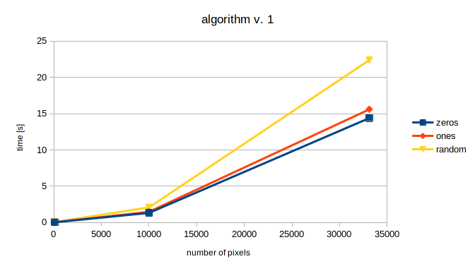

# Interview task for c9...
If you don't know why you are here, in this repo, just leave. This repo should be public and README shouldn't be too descriptive.

## Performance

#### Algorithm version: 1
| input size  | zeros | ones | random |
|-------------|-------|----- |--------|
| 100         | 0.04  | 0.04 | 0.07   |
| 1000        | 1.33  | 1.48 | 2.088  |
| 33124       | 14.4  | 15.6 | 22.4   |

